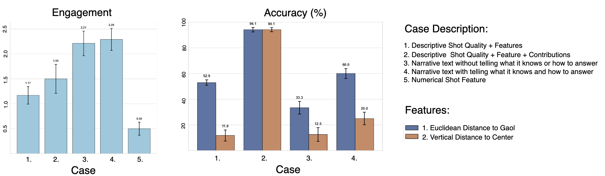

# Football Shot Analyst Framework

## Model Card

### **Model Overview**
- **Name:** Football Shot Analyst (xG Prediction + Language Model)
- **Version:** 1.0
- **Developers:** The football Shot Analyst is implemented within the [TwelveGPT Education framework](https://github.com/soccermatics/twelve-gpt-educational), customized by Pegah Rahimian and David Sumpter as a part of Uppsala University research, and
is intended as an illustration of the methods. This work is a derivative of the full [Twelve GPT product](https://twelve.football).
- **Date of Creation:** [Autumn 2024]
- **Purpose:** 
  - Here we detail the specific application to analyze shots. It is thus intended as an example to help others building wordalisations. The wordalisations describe shots attempted by players with different outcomes (goal or not) in EURO 2024.
  - Predict the quality of football shots using an xG model.
  - Translate the numeric xG predictions and associated features into engaging and informative textual descriptions using a language model.

---

### **Intended Use**
- **Primary Use Cases:**
  - Analyzing football match data to assess shot quality and contributing factors.
  - Generating automated yet human-readable summaries of football shots for analysts, commentators, or fans.
- **Target Users:**
  - Sports analysts and coaches.
  - Football commentators seeking quick insights during live games.
  - Enthusiasts exploring data-driven insights into football.

---

### **Model Architecture**
- **xG Prediction Model:**
  - **Framework:** [Logistic Regression]
  - **Features:** 
    - vertical distance to center	
    - euclidean distance to goal	
    - nearby opponents in 3 meters
    - opponents in triangle	
    - goalkeeper distance to goal	
    - distance to nearest opponent	
    - angle to goalkeeper	
    - shot with left foot	
    - shot after throw_in	
    - shot after corner	
    - shot after free_kick
  - **Output:** xG value (range: 0 to 1), indicating the probability of scoring.
  
  
- **Language Model for Descriptions:**
  - **Framework:** The wordalisation supports both GPT4o and ChatGPT and related APIs, as well as Gemini API. 
  - **Input:** Synthetic textual prompts derived from xG model predictions and contributing factors.
  - **Output:** Structured, engaging narratives about the shots.

---

### **Training Data**
- **xG Prediction Model:**
  - **Source:** The datasets used in this work was obtained from the Hudle StatsBomb events and StatsBomb360 datasets for the following competitions: EURO Men 2024 and 2022, National Women's Soccer League (NWSL) 2018, FIFA 2022, Women's Super League (FAWSL) 2017, and Africa Cup of Nations (AFCON) 2023 , all fetched using the [statsbombpy API](https://github.com/statsbomb/statsbombpy).
  - **Dataset:** The StatsBomb events dataset contains 110 columns describing various aspects of each event, while the StatsBomb360 dataset includes 7 columns detailing the position of players visible in the frame of the action. These datasets were merged to provide a comprehensive view of the events for all matches played by the 24 teams participating in UEFA EURO 2024.
  - **Preprocessing:** Normalized pitch coordinates, synchronising events with freeze frames (location of all visible players in the frame), engineered features for distance/angle metrics, and exclusion of ambiguous events.
  
- **Prompts for the Language Model:**
  - To generate engaging and contextually relevant descriptions of xG (Expected Goals) predictions, we rely on structured prompts and percentile-based categorization of xG values. These structured examples guide the model in transforming numerical predictions into natural language that can captivate the audience.
  - The prompt to *tell it who it is* identifies a human role for the wordalisation as a "data analysis bot". The user-assistant pairs in the stage of *tell it what it knows* describe how the data metrics can be [interpretted in footballing terms](https://github.com/soccermatics/twelve-gpt-educational/blob/main/data/describe/action/shots.xlsx). These descriptions outline the meaning of the footballing terms.
  - In the text which is generated at the stage of *tell it what data to use* we use the following function to translate numbers and thresholds to evaluation words:
    ```python
    def describe_xg(xG):

        if xG < 0.028723: # 25% percentile
            description = "This was a slim chance of scoring."
        elif xG < 0.056474: # 50% percentile
            description = "This was a low chance of scoring."
        elif xG < 0.096197: # 75% percentile
            description = "This was a decent chance."
        elif xG < 0.3: # very high
            description = "This was a high-quality chance, with a good probability of scoring."
        else:
            description = "This was an excellent chance."
        
        return description
    ```
  - In the *tell it how to answer* step, we ask the language model the following:
    ```python
    def get_prompt_messages(self):
        prompt = (
            "You are a football commentator. You should write in an exciting and engaging way about a shot"
            f"You should giva a four sentence summary of the shot taken by the player. "
            "The first sentence should say whether it was a good chance or not, state the expected goals value and also state if it was a goal. "
            "The second and third sentences should describe the most important factors that contributed to the quality of the chance. "
            "If it was a good chance these two sentences chould explain what contributing factors made the shot dangerous. "
            "If it wasn't particularly good chance then these two sentences chould explain why it wasn't a good chance. "
            "Depedning on the quality of the chance, the final sentence should either praise the player or offer advice about what to think about when shooting."
            )
        return [{"role": "user", "content": prompt}]
    ```
  - Example Outputs:
    > A goal! Wirtz finds the back of the net with a shot that, while only a 15% chance according to xG (0.15), proved deadly accurate. The central location of the shot, right down the middle, significantly increased its probability, while the lack of immediate pressure allowed him the time and space to pick his spot. Despite multiple defenders in the way, Wirtz showed composure and skill beyond his years! A truly magnificent finish!

---

### **Evaluation**

We evaluate the whole system through the following 2 components: xG prediction performance and Wordalisation approach. 

---

## 1. xG Prediction Model

### Accuracy

The xG models were validated using 10-fold cross-validation for each of the following competition datasets: EURO Men 2024 and 2022, National Women's Soccer League (NWSL) 2018, FIFA 2022, Women's Super League (FAWSL) 2017, and Africa Cup of Nations (AFCON) 2023, ensuring robustness across different data subsets. Performance was assessed using the Area Under the Receiver Operating Characteristic Curve (AUC-ROC), which evaluates the models' ability to distinguish between goals and non-goals.

An **AUC-ROC score of 0.8** was achievedon average of all competitions (see each model separately below), indicating acceptable predictive performance and discrimination between the two classes.

Additionally, we report the **Brier score** and **log-loss** metrics, which provide further insights into the model's probabilistic predictions:

- Average **Brier score of 0.06** indicates that the models' predictions are well-calibrated and close to the actual outcomes, showing good accuracy in its probability estimates.
- The **log-loss of 0.2** reflects the model's confidence in its predictions, with values closer to 0 indicating better performance.

Both metrics complement the AUC-ROC score by providing a more comprehensive evaluation of the models' effectiveness in predicting shot outcomes, ensuring both accuracy and reliability in its probabilistic outputs. These metrics are especially relevant for our application, as they assess not just classification accuracy but also the quality of the model's probability estimates in a context where uncertainty plays a key role.

---

### Performance Metrics across subgroups**:  

Tested for different leagues and playing styles to ensure robustness.


| Tournament                                | ROC (%) | Brier Score | Log-Loss |
|------------------------------------------|---------|--------------|-----------|
| EURO Men 2024                             | 81      | 0.05         | 0.19      |
| EURO Men 2022                             | 81      | 0.08         | 0.27      |
| Women's Super League (FAWSL) 2017-18      | 76      | 0.09         | 0.31      |
| National Women's Soccer League 2018      | 78      | 0.06         | 0.22      |
| FIFA 2022                                 | 77      | 0.08         | 0.29      |
| Africa Cup of Nations (AFCON) 2023       | 84      | 0.05         | 0.20      |


---

## 2. Wordalisation Approach

The evaluation of the wordalisation approach focuses on two key metrics: **engagement** and **accuracy**. 

- **Engagement** measures how interesting and engaging the generated descriptions are, assessed using an LLM prompted with:  
  *"Rank this text on a scale from 0 to 5 for how interesting and engaging it is."*

- **Accuracy** evaluates how well the descriptions align with the true contributions of features to expected goals (xG), determined by prompting the LLM with:  
  *"In the following text, was [Feature] a positive, negative, or not contributing factor? Respond with one of [’positive’, ’negative’, ’not contributing’]."*

Ground truth labels are derived from feature contributions:
- Values above 0.1 → **positive**
- Values below -0.1 → **negative**
- Between -0.1 and 0.1 → **neutral**

Five cases were tested:
- **Case 1**: Shot Quality + Feature Descriptions  
- **Case 2**: Shot Quality + Features + Contributions  
- **Case 3**: LLM-generated text without guidance  
- **Case 4**: LLM-generated text with contextual examples  
- **Case 5**: Only numerical feature values  

**Case 2** achieved the highest accuracy, particularly for key features like `Euclidean distance to goal` and `vertical distance to center`, but had lower engagement.  
**Case 4**, which combines narrative elements with contextual guidance, struck the best balance, offering high engagement and the second-highest accuracy — making it the most practical for real-world use.

The results highlight the trade-off between engagement and accuracy, with **Case 4** emerging as the optimal choice for providing insightful, interpretable, and actionable insights for football practitioners.

  
*Figure: Engagement and Accuracy scores averaged over 10 runs, with standard deviation shown on top of the bars.*

---

### Ethical Considerations


## 3. Responsible AI Considerations

All code and experiments are open-sourced, with detailed instructions for data preprocessing, model training, and evaluation to ensure reproducibility. 

To mitigate potential **bias**, we analyzed feature importances across gender-based leagues and playing levels. While model performance was stable, feature weights occasionally reflected dataset-specific biases (e.g., league-specific shooting distances), reinforcing the need for context-aware training.
The development and deployment of this xG wordalisation system raise several ethical considerations. While the system aims to enhance the interpretability and accessibility of Expected Goals (xG) models for football practitioners, it is essential to recognize the potential implications of automating performance evaluations. The system generates textual descriptions of player performance based on data, which could influence decision-making in professional settings, such as scouting or team selection. This raises concerns about the fairness and transparency of such evaluations, particularly when applied to players whose livelihoods depend on these assessments. Additionally, the system relies on data that may not account for broader contextual factors, such as injuries, personal circumstances, or team dynamics, which can significantly impact performance. Care must be taken to ensure that the generated narratives are not overly deterministic or reductive, as this could lead to misinterpretations or undue scrutiny of players. Furthermore, the system's reliance on Large Language Models (LLMs) introduces potential biases inherent in the training data of these models, which could affect the fairness and objectivity of the generated explanations. To mitigate these risks, the system is designed with transparency in mind, providing an open-source application and detailed model card to encourage scrutiny and accountability. Future work should focus on validating the system in real-world settings and incorporating feedback from coaches and players to ensure it aligns with ethical standards and practical needs.

We acknowledge the broader ethical responsibility of AI in sports analytics and encourage future work to systematically audit fairness, especially across underrepresented leagues.


## 4. Generalisation and Stability

To account for contextual differences between leagues (e.g., tactical styles, player behavior, data distributions), we trained separate xG models for each competition. This approach allows the model to better adapt to each environment, rather than assuming a one-size-fits-all solution.

To evaluate the **stability and generalisability** of the wordalisation method, we compared feature contributions (using our contribution plots) and generated explanations across competitions. We observed that core predictive features—such as `Euclidean distance to goal`, and `vertical distance to center`—consistently emerged as influential across datasets. These features also maintained a stable semantic meaning, allowing for transferable interpretation across competitions.

However, we did observe variation in the influence of less frequent or context-dependent features (e.g., shot pressure, possession phase), which may be attributed to differences in data availability or tactical patterns across competitions. This highlights the value of training models per competition while maintaining a consistent explanatory framework.

The modularity of the wordalisation pipeline allows for its extension to new machine learning models, new datasets or competitions, and future work may explore transfer learning techniques to improve cross-competition consistency while preserving contextual nuance.


---

### **Limitations**
- **xG Prediction Model:**
  - Dataset bias: Performance may degrade for leagues or matches with sparse data.
  - Feature sensitivity: Model relies heavily on accurate event tagging and player tracking.
  
- **Language Model:**
  - Generalization limits: May produce repetitive or overly generic narratives for uncommon scenarios.
  - Dependency on prompt quality: Requires carefully crafted input for optimal performance.


---

### **Caveats and Recommendations**
- Ensure the input data is preprocessed and normalized according to the model's requirements.
- Use the generated text descriptions as supplementary insights, not as definitive analyses.

---
